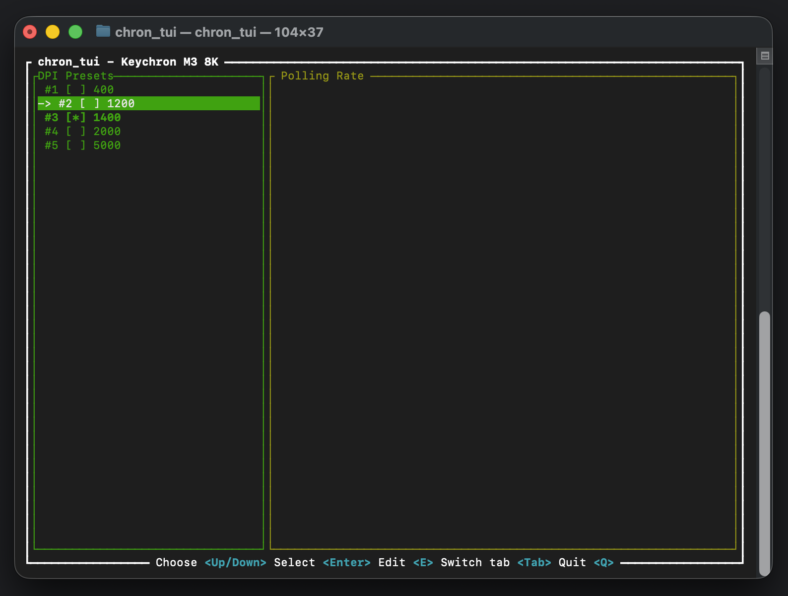

# chron_tui - Terminal user interface for adjusting Keychron mouse settings

⚠️ Warning - the project is in a very early stage, try at your own risk and expect A LOT of issues

## Device support

### Keychron M3 8K

| Feature                       | Status          | Notes                                                                         |
|-------------------------------|-----------------|-------------------------------------------------------------------------------|
| **Connecting to the device**  | ⚠️ Partial      | Connecting often does not work on the first try, but works on subsequent ones |
| **Wired/Wireless connection** | ✅ Supported     | Both wired (0xd050) and wireless receiver (0xd028)                            |
| **DPI Preset Selection**      | ✅ Supported     | Switch between 5 DPI presets                                                  |
| **DPI Preset Customization**  | ❌ Not Supported | Values are currently hardcoded                                                |
| **Polling Rate**              | ❌ Not Supported | UI placeholder exists, not yet functional                                     |
| **Device Info Query**         | ❌ Not Supported | Command sent but response not parsed                                          |
| **RGB Lighting Control**      | ❌ Not Supported |                                                                               |
| **Button Remapping**          | ❌ Not Supported |                                                                               |
| **Lift-off Distance**         | ❌ Not Supported |                                                                               |

#### Legend

- ✅ **Supported**: Feature is fully implemented and working
- ⚠️ **Partial**: Feature is in development or partially implemented
- ❌ **Not Supported**: Feature is not currently planned or implemented
